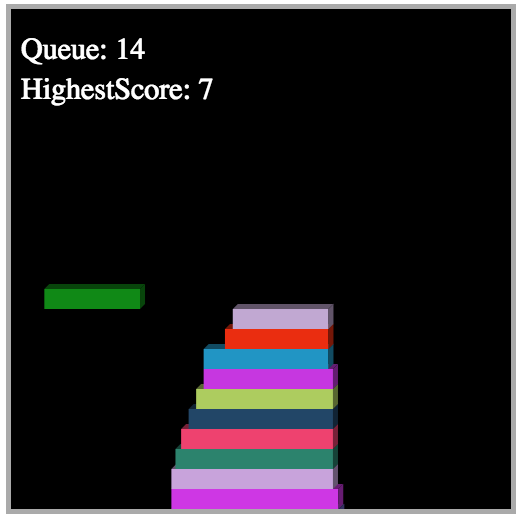

# QUEUE

[Live][link]
[link]: http://zhuleijia.github.io/queue/

## Instructions

Queue is a browser game inspired by Stack built using Javascript and HTML5 Canvas.

1. Use the "Enter" or "Return" key to place the moving rectangle on top of your stack.
2. If your rectangles do not align closely, the top rectangle will get smaller and the next rectangle will be harder to place.
3. The game ends when you place a rectangle that does not overlap the top rectangle at all.

Good Luck!

